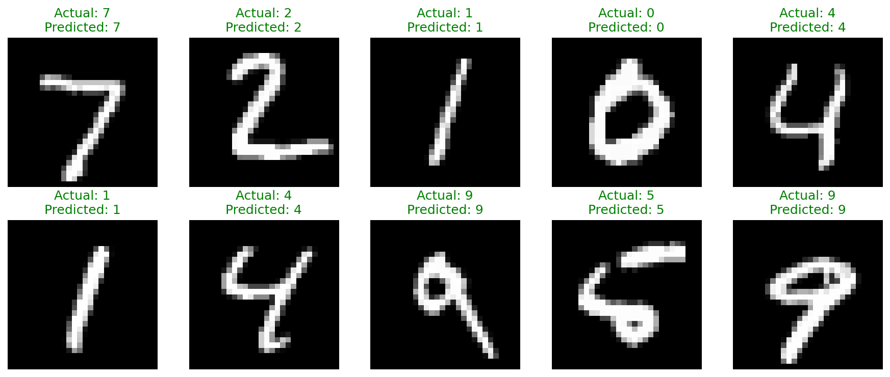
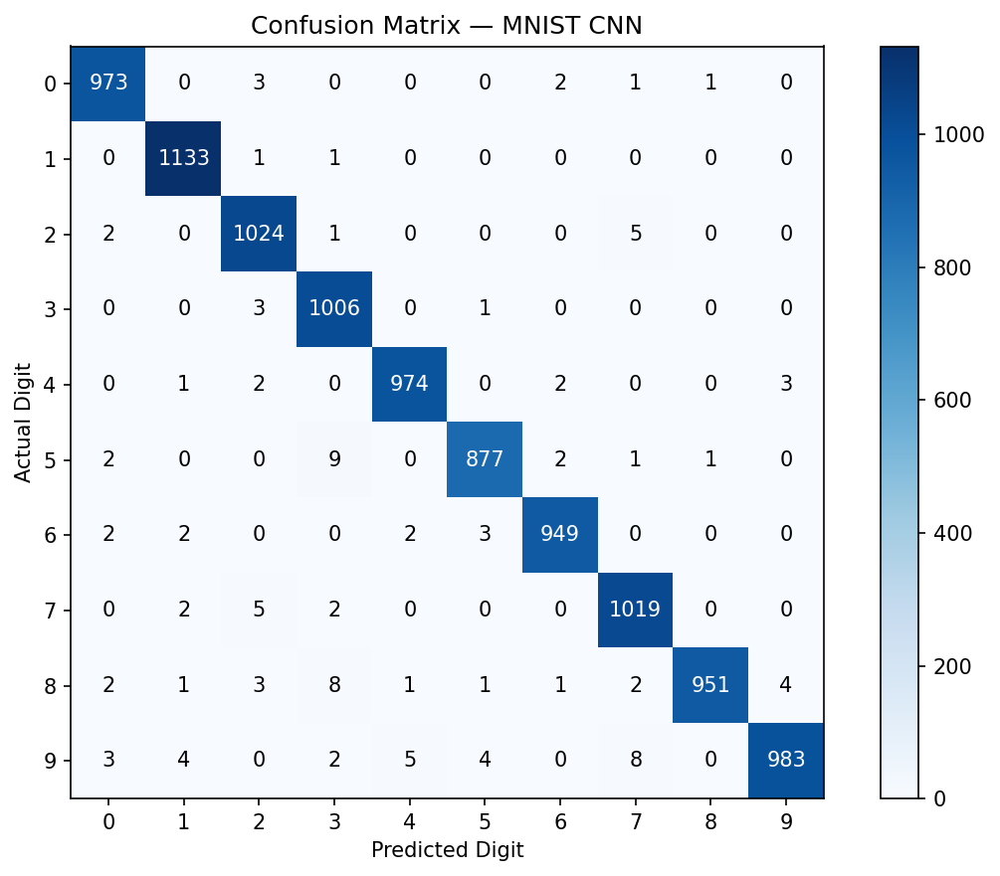
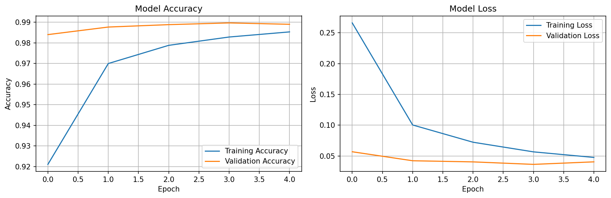

# CodeAlpha Handwritten Character Recognition

A beginner-friendly deep learning project that recognizes handwritten digits using a Convolutional Neural Network (CNN).

## Objective

Build an image-classification model that identifies handwritten characters. This implementation uses the MNIST dataset, which contains handwritten digits from 0 to 9.

## Dataset

- **Dataset:** MNIST Handwritten Digits
- **Training images:** 60,000
- **Testing images:** 10,000
- **Image size:** 28 × 28 grayscale pixels
- **Classes:** 10 digits (0–9)

## Technologies Used

- Python
- TensorFlow / Keras
- NumPy
- Matplotlib
- Google Colab / Jupyter Notebook

## Model Architecture

The CNN contains:

1. Convolutional layer with 32 filters
2. Max-pooling layer
3. Convolutional layer with 64 filters
4. Max-pooling layer
5. Flatten layer
6. Dense layer with 64 neurons
7. Dropout layer
8. Output layer with 10 neurons and Softmax activation

## Results

The model was trained for 5 epochs and achieved:

- **Training Accuracy:** 98.53%
- ## Sample Results

### Sample Predictions



### Confusion Matrix



### Training Curves


- **Test Accuracy:** 98.89%

The model performs strongly on unseen handwritten-digit images.

## Project Files

- `Handwritten_Character_Recognition.ipynb` — Complete implementation, training, evaluation, predictions, confusion matrix, and charts
- `requirements.txt` — Required Python packages

## How to Run

1. Clone this repository or download the notebook.
2. Install dependencies:

```bash
pip install -r requirements.txt
```

3. Open `Handwritten_Character_Recognition.ipynb` in Jupyter Notebook or Google Colab.
4. Run the cells from top to bottom.

## Future Improvements

- Extend the model to recognize letters using the EMNIST dataset.
- Add a drawing interface for users to test their own handwritten digits.
- Use data augmentation to improve robustness.
- Explore a CRNN model for handwritten word recognition.

## Author

Mohammed Salman  
CodeAlpha Machine Learning Internship — Task 3
